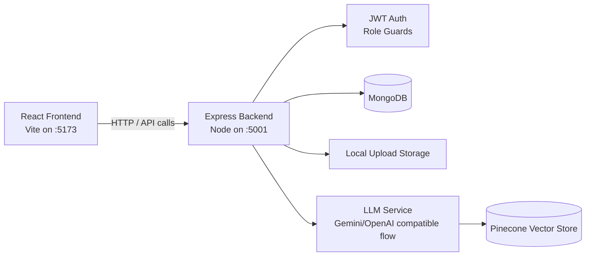
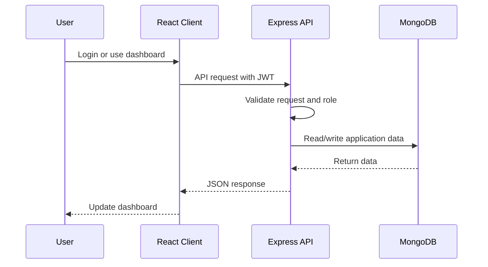
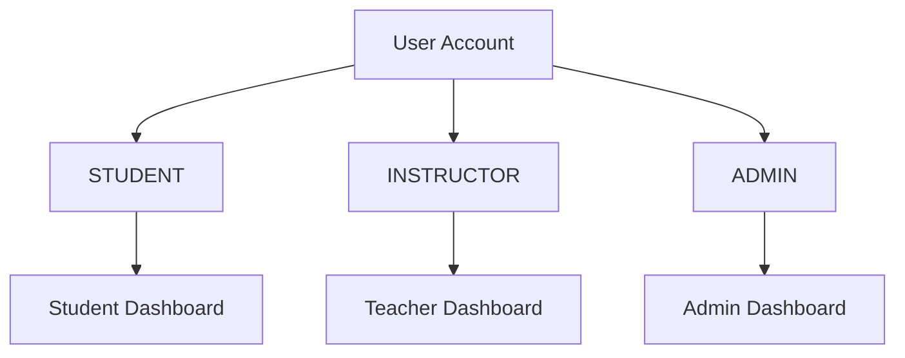

# SamVidyaa

SamVidyaa is a full-stack learning and lab-management platform for students, instructors, and administrators. It combines course management, task workflows, student progress tracking, rewards, announcements, analytics, protected file handling, and an AI-assisted chat experience.

The project is organized as a React/Vite frontend and an Express/MongoDB backend.

## Table of Contents

- [Overview](#overview)
- [Features](#features)
- [Architecture](#architecture)
- [Tech Stack](#tech-stack)
- [Project Structure](#project-structure)
- [Quickstart](#quickstart)
- [Environment Variables](#environment-variables)
- [Common Scripts](#common-scripts)
- [API Surface](#api-surface)
- [Testing](#testing)
- [Deployment Notes](#deployment-notes)

## Overview

SamVidyaa gives each role a focused workspace:

| Role | What they can do |
| --- | --- |
| Student | Enroll in courses, complete tasks, view analytics, track history, claim rewards, use chat, and view leaderboards. |
| Instructor | Create courses, modules, and tasks, import task documents, upload handouts, view course analytics, manage rewards, and post course announcements. |
| Admin | Manage platform-wide courses, announcements, testimonials, privileged users, desktop app assets, and overall platform activity. |

## Features

- Role-based authentication with JWT-protected API routes
- Optional Google sign-in support
- Course, module, and task management
- Student enrollment workflows
- Student progress analytics and task history
- Instructor course analytics and performance views
- Rewards, points, and leaderboard features
- Global and course-specific announcements
- File and handout upload support
- Desktop app asset publishing support
- AI chat service with optional document ingestion and vector search
- Request logging, rate limiting, validation, and centralized error handling

## Architecture



### Request Flow



### Role Model



## Tech Stack

| Layer | Tools |
| --- | --- |
| Frontend | React 18, Vite, React Router, Framer Motion, Lucide, React Icons, Three.js |
| Backend | Node.js, Express 5, Mongoose, JWT, bcryptjs, multer |
| Database | MongoDB |
| AI/RAG | Google Generative AI, OpenAI SDK, Pinecone |
| Testing | Node test runner |
| Deployment | Vercel config for the frontend, Node backend deployable separately |

## Project Structure

```text
.
|-- backend/
|   |-- app.js                  # Express app configuration and routes
|   |-- server.js               # Server startup, DB connection, service initialization
|   |-- config/                 # MongoDB connection
|   |-- controllers/            # Route handlers
|   |-- middleware/             # Auth, validation, rate limiting, logging, errors
|   |-- models/                 # Mongoose models
|   |-- routes/                 # API route definitions
|   |-- services/               # Analytics, chat, vector store, monitoring, events
|   |-- tests/                  # Backend tests
|   `-- uploads/                # Runtime uploaded assets
|
|-- client/
|   |-- src/
|   |   |-- components/         # Shared UI and dashboard components
|   |   |-- context/            # Auth, theme, and i18n providers
|   |   |-- pages/              # Landing, auth, and role dashboards
|   |   |-- utils/              # Frontend helpers
|   |   |-- App.jsx             # Route definitions
|   |   `-- config.js           # API base URL
|   |-- public/                 # Static files and templates
|   |-- package.json
|   `-- vite.config.js
|
`-- README.md
```

## Quickstart

### 1. Prerequisites

Install these first:

- Node.js 18 or newer
- npm
- MongoDB running locally, or a MongoDB Atlas connection string

### 2. Install dependencies

```bash
cd backend
npm install

cd ../client
npm install
```

### 3. Configure the backend

Create `backend/.env`:

```env
PORT=5001
MONGO_URI=mongodb://localhost:27017/college-lab-dashboard
JWT_SECRET=replace-with-a-long-random-secret
ALLOWED_ORIGINS=http://localhost:5173,http://127.0.0.1:5173
```

Optional AI and Google login variables are documented in [Environment Variables](#environment-variables).

### 4. Configure the frontend

Create `client/.env`:

```env
VITE_API_URL=http://localhost:5001
```

If using Google sign-in:

```env
VITE_GOOGLE_CLIENT_ID=your-google-client-id.apps.googleusercontent.com
```

### 5. Run the backend

```bash
cd backend
npm run dev
```

The API starts on:

```text
http://localhost:5001
```

Health check:

```text
http://localhost:5001/health
```

### 6. Run the frontend

In a second terminal:

```bash
cd client
npm run dev
```

Open:

```text
http://localhost:5173
```

## Environment Variables

### Backend

| Variable | Required | Default | Purpose |
| --- | --- | --- | --- |
| `PORT` | No | `5001` | Backend server port |
| `MONGO_URI` | No | `mongodb://localhost:27017/college-lab-dashboard` | Main MongoDB connection |
| `JWT_SECRET` | Yes | None | Signs and verifies JWT auth tokens |
| `ALLOWED_ORIGINS` | No | `http://localhost:5173,http://127.0.0.1:5173` | CORS allowlist |
| `GOOGLE_CLIENT_ID` | Optional | None | Backend Google auth verification |
| `VITE_GOOGLE_CLIENT_ID` | Optional | None | Fallback Google client ID used by backend |
| `GEMINI_API_KEY` | Optional | None | LLM/chat provider key |
| `GOOGLE_API_KEY` | Optional | None | LLM embeddings/vector support; falls back to `GEMINI_API_KEY` or `LLM_API_KEY` |
| `LLM_API_KEY` | Optional | None | Generic LLM API key fallback |
| `LLM_MODEL` | Optional | `gemini-2.5-flash-lite` | Chat model name |
| `PINECONE_API_KEY` | Optional | None | Pinecone vector database key |
| `PINECONE_INDEX_NAME` | Optional | `samvidyaa-docs` | Pinecone index name |
| `PINECONE_REGION` | Optional | `us-east-1` | Pinecone serverless region |
| `MONGO_ANALYTICS_DB_NAME` | Optional | `samvidya_analytics` | Analytics database name |
| `SLOW_REQUEST_THRESHOLD_MS` | Optional | `1500` | Slow request logging threshold |

### Frontend

| Variable | Required | Default | Purpose |
| --- | --- | --- | --- |
| `VITE_API_URL` | No | `http://localhost:5001` | Backend API base URL |
| `VITE_GOOGLE_CLIENT_ID` | Optional | None | Enables Google sign-in UI |

## Common Scripts

### Backend

```bash
cd backend
npm run dev      # Start API with nodemon
npm start        # Start API with node
npm test         # Run backend tests
```

### Frontend

```bash
cd client
npm run dev      # Start Vite dev server
npm run build    # Build production frontend
npm run preview  # Preview production build
```

## API Surface

The backend mounts these main route groups:

| Route | Purpose |
| --- | --- |
| `GET /health` and `GET /api/health` | Service health check |
| `/api/auth` | Register, login, Google auth |
| `/api/users` | User account operations |
| `/api/courses` | Courses, handouts, stats, analytics, export |
| `/api/modules` | Course module management |
| `/api/tasks` | Tasks, imports, completion, history, desktop results |
| `/api/enrollments` | Course enrollment workflows |
| `/api/rewards` | Rewards and points workflows |
| `/api/leaderboard` | Student and class rankings |
| `/api/chat` | Chat, history, document ingestion |
| `/api/collaborations` | Student collaboration requests |
| `/api/announcements` | Global and course announcements |
| `/api/testimonials` | Testimonial publishing |
| `/api/files` | Protected file access |
| `/api/desktop-app` | Desktop app asset publishing |

## Testing

Run backend tests:

```bash
cd backend
npm test
```

The test suite covers controllers, middleware, validation, analytics services, authentication, leaderboard behavior, spreadsheet parsing, and selected security flows.

## Deployment Notes

### Frontend

The frontend is a Vite app and can be deployed to Vercel or any static hosting provider.

```bash
cd client
npm run build
```

Set `VITE_API_URL` in the hosting provider so the deployed frontend points to the deployed backend.

### Backend

Deploy the backend as a Node.js service. At minimum, configure:

```env
MONGO_URI=your-production-mongodb-uri
JWT_SECRET=your-production-secret
ALLOWED_ORIGINS=https://your-frontend-domain.com
```

For AI chat and document retrieval, also configure the relevant Gemini/Google/Pinecone variables.

## Development Notes

- The backend uses centralized request validation and role checks. Add new API routes through `backend/routes`, then keep controller logic in `backend/controllers`.
- The frontend API base URL is controlled by `client/src/config.js`.
- Uploaded files live under `backend/uploads`; only explicitly public testimonial uploads are served statically.
- `.DS_Store` and local note files are ignored by Git.
